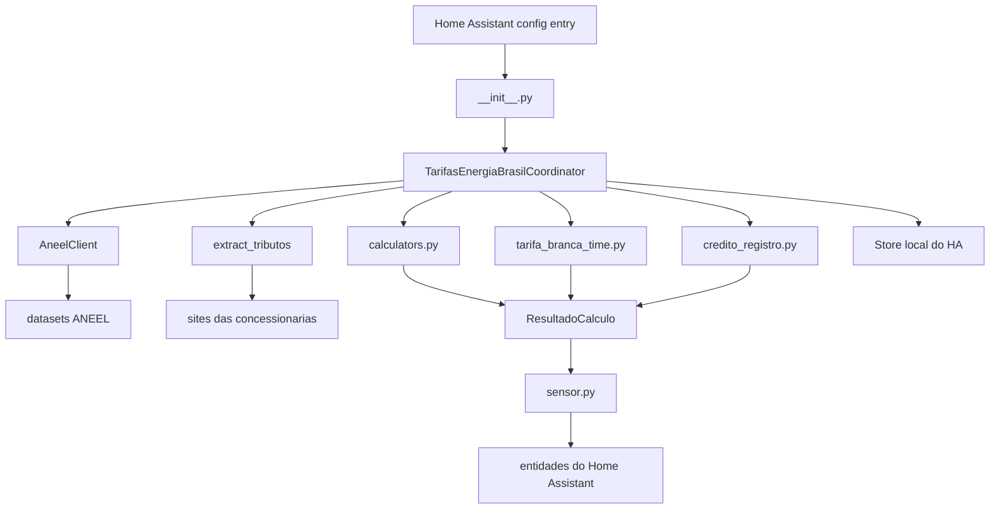

# Manual tecnico do codigo - Tarifas Energia Brasil

Versao documentada: 0.1.0-alpha.10  
Gerado em: 2026-04-25 22:25:00 -03:00  
Criado por: Codex  
Projeto/pasta: ha.ext.tarifas / tarifas_energia_brasil

Este documento e um mapa tecnico para desenvolvedores entenderem como a extensao funciona na versao atual. Ele descreve arquitetura, fluxo de execucao, objetos, funcoes, sensores, persistencia, diagnosticos e pontos de manutencao. Alteracoes historicas ficam no `CHANGELOG.md`.

## Atualizacao 0.1.0-alpha.10

Esta versao corrige o calculo do sensor `Fio B final` para respeitar o `ICMS` atualmente aplicado pela regra de faixa mensal. No inicio do ciclo, quando o consumo acumulado ainda estiver na faixa isenta, a expressao do calculo passa a usar `0%` no consumo, evitando projetar a maior faixa de ICMS antes da hora.

O sensor continua expondo atributos de auditoria, incluindo a expressao textual do calculo, Fio B com transicao, TUSD de consumo final, TUSD creditada final, ICMS de consumo, ICMS de compensacao e PIS/COFINS aplicados. O sensor `ICMS` tambem passa a expor a expressao que justifica o percentual atual, usando as faixas cadastradas por concessionaria e indicando alternativo quando nao houver regra especifica.

## Visao geral

`Tarifas Energia Brasil` e uma integracao customizada para Home Assistant publicada como repositorio HACS. A integracao consulta fontes abertas da ANEEL e paginas de concessionarias para estimar tarifas, tributos e valores de conta de energia no Brasil.

Ela trabalha com tres eixos principais:

- Coleta de dados externos: tarifas ANEEL, componentes tarifarios, bandeiras e tributos.
- Apuracao local: leitura de entidades acumuladas de consumo, geracao e injecao no Home Assistant.
- Publicacao: sensores de tarifas, tributos, bandeira, valores estimados de conta, Tarifa Branca e geracao/SCEE.

O dominio da integracao e `tarifas_energia_brasil`.

## Arquitetura



## Estrutura de pastas

| Caminho | Finalidade |
|---|---|
| `custom_components/tarifas_energia_brasil/` | Codigo da integracao Home Assistant. |
| `custom_components/tarifas_energia_brasil/tributos/` | Analisadors e extratores de tributos de concessionarias. |
| `custom_components/tarifas_energia_brasil/translations/` | Textos de UI para o Home Assistant. |
| `custom_components/tarifas_energia_brasil/brand/` | Icone da integracao. |
| `tests/` | Testes unitarios e stubs de Home Assistant. |
| `tests/fixtures/` | Amostras HTML usadas pelos analisadors de tributos. |
| `docs/` | Documentacao auxiliar por tema. |

## Modulos principais

| Modulo | Responsabilidade |
|---|---|
| `__init__.py` | Registra a integracao, cria o coordinator, encaminha plataformas, inicia listeners e persiste estado no unload. |
| `const.py` | Centraliza dominio, versao, constantes, chaves de configuracao, padraos, concessionarias, grupos de entidade e alternativo ANEEL. |
| `config_flow.py` | Implementa fluxo inicial e options flow no Home Assistant. |
| `coordinator.py` | Orquestra coleta, calculos, acumuladores, persistencia, registro SCEE e diagnosticos. |
| `aneel_client.py` | Cliente CKAN da ANEEL com alternativo entre metodos de acesso. |
| `calculators.py` | Funcoes puras de conversao, tarifa, tributos, disponibilidade, Fio B, bandeira e SCEE. |
| `credito_registro.py` | Controle dos creditos de energia por competencia mensal. |
| `tarifa_branca_time.py` | Horarios, feriados, posto tarifario vigente e rateio temporal da Tarifa Branca. |
| `sensor.py` | Definicao e criacao das entidades `sensor`. |
| `models.py` | Dataclasses compartilhadas entre coleta, calculo e publicacao. |
| `diagnosticos.py` | Payload de diagnostico redigindo entidades configuradas. |

## Ciclo de vida no Home Assistant

1. `async_setup()` cria `hass.data[DOMAIN]`.
2. `async_setup_entry()` instancia `TarifasEnergiaBrasilCoordinator`.
3. O coordinator executa `async_config_entry_first_refresh()`.
4. A integracao registra listeners de mudanca das entidades de consumo, geracao e injecao.
5. A plataforma `sensor` e carregada via `async_forward_entry_setups()`.
6. `sensor.py` cria entidades conforme grupos e quebras configuradas.
7. Quando options mudam, `async_reload_entry()` recarrega a entrada.
8. No unload, listeners sao removidos e o estado incremental e persistido.

## Configuracao

O fluxo inicial (`TarifasEnergiaBrasilConfigFlow`) pede:

- `concessionaria`: concessionaria suportada no fluxo.
- `dia_leitura_reset_mensal`: dia de fechamento do ciclo mensal, limitado a 1-31.
- `frequencia_atualizacao_horas`: intervalo de coleta externa.
- `meio_prioritario_aneel`: metodo preferencial para consulta ANEEL.
- `entidade_consumo_kwh`: sensor acumulado de consumo.
- `entidade_geracao_kwh`: sensor acumulado de geracao, opcional.
- `entidade_injecao_kwh`: sensor acumulado de energia injetada, opcional e recomendado para SCEE/auto-consumo preciso.
- `tipo_fornecimento`: `monofasico`, `bifasico` ou `trifasico`.
- `quebras_calculo`: `diario`, `semanal` e/ou `mensal`.

O options flow tambem permite:

- habilitar ou ocultar o grupo `Geracao/SCEE`;
- habilitar ou ocultar o grupo `Tarifa Branca`;
- sobrescrever horarios da Tarifa Branca;
- informar feriados extras em `YYYY-MM-DD`.

Novas entradas iniciam Tarifa Branca desabilitada por padrao, mas entradas antigas mantem compatibilidade quando a chave ainda nao existe.

## Concessionarias

As concessionarias prontas para selecao no fluxo sao retornadas por `obter_concessionarias_suportadas_para_fluxo()` a partir de `CONCESSIONARIAS_SUPORTADAS`.

Na versao atual:

| Concessionaria | Status no fluxo | Extrator |
|---|---|---|
| `CPFL-PIRATINING` | Suportada | `cpfl_piratining` |
| `CPFL-PAULISTA` | Suportada | `cpfl_paulista` |
| `CELESC` | Suportada | `celesc` |
| `RGE SUL` | Mapeada, nao habilitada | `rge_sul` |
| `CEMIG-D` | Mapeada, nao habilitada | `cemig_d` |
| `ENEL SP` | Mapeada, nao habilitada | `enel_sp` |

## Coleta ANEEL

`AneelClient` consulta o CKAN da ANEEL em `https://dadosabertos.aneel.gov.br/api/3/action`.

Metodos suportados:

- `datastore_search`;
- `datastore_search_sql`;
- `csv_xml`.

A ordem efetiva e montada por `obter_ordem_alternativa_metodo_aneel()`, colocando o metodo escolhido pelo usuario primeiro e os demais como alternativo.

Datasets usados:

| Dado | Resource ID | Uso |
|---|---|---|
| Tarifas distribuidoras | `fcf2906c-7c32-4b9b-a637-054e7a5234f4` | TE/TUSD convencional e Tarifa Branca. |
| Bandeira vigente | `0591b8f6-fe54-437b-b72b-1aa2efd46e42` | Competencia e cor/status da bandeira. |
| Adicional da bandeira | `5879ca80-b3bd-45b1-a135-d9b77c1d5b36` | Valor adicional em R$/MWh convertido para R$/kWh. |
| Componentes tarifarios | `e8717aa8-2521-453f-bf16-fbb9a16eea39`, `a4060165-3a0c-404f-926c-83901088b67c`, `70ac08d1-53fc-4ceb-9c22-3a3a2c70e9fa` | Busca multi-ano do componente `TUSD_FioB`. |

O cliente seleciona linhas residenciais B1 e evita linhas sociais, baixa renda, SCEE ou detalhes especiais quando existe a linha padrao residencial.

## Tributos

`extract_tributos()` retorna `DadosTributos` com:

- concessionaria;
- competencia;
- PIS;
- COFINS;
- ICMS;
- fonte;
- confianca;
- erros e pendencias.

Os analisadors em `tributos/analisadors.py` transformam HTML das concessionarias em aliquotas normalizadas. Os fixtures em `tests/fixtures` protegem contra regressao de analisador.

Quando ha regra conhecida de ICMS por faixa, `resolve_icms_percent()` aplica a aliquota conforme consumo mensal apurado. Quando nao ha historico suficiente no bootstrap, o coordinator usa alternativo da fonte de tributos para evitar escolher uma faixa indevida.

## Objetos de dados

### `MetadadosColeta`

Metadados de coleta associados a cada sensor:

- `ultima_coleta`;
- `fonte`;
- `dataset`;
- `resource_id`;
- `metodo_acesso`;
- `usou_alternativo`;
- `tentativas`;
- `mensagem_erro`;
- `confianca_fonte`;
- `vigencia_inicio`;
- `vigencia_fim`.

`como_atributos()` remove valores nulos antes de publicar atributos.

### `DadosTributos`

Representa aliquotas de uma concessionaria:

- `pis_percent`;
- `cofins_percent`;
- `icms_percent`;
- `fonte`;
- `confianca`.

### `ResultadoCalculo`

Objeto entregue pelo coordinator aos sensores:

- `atualizado_em`: instante da atualizacao;
- `concessionaria`: concessionaria da entrada;
- `valores`: chaves e valores finais publicados;
- `coletas_por_chave`: metadados por chave;
- `diagnosticos`: informacoes tecnicas de apoio.

### `CreditoEntry`

Representa creditos SCEE:

- `competencia`: `YYYY-MM`;
- `kwh`: saldo em kWh.

## Coordinator

`TarifasEnergiaBrasilCoordinator` e a classe central. Ela herda de `DataUpdateCoordinator[ResultadoCalculo]`.

Estado interno principal:

- `_last_consumo_total_kwh`, `_last_geracao_total_kwh` e `_last_injecao_total_kwh`;
- `_last_consumo_timestamp`, `_last_geracao_timestamp` e `_last_injecao_timestamp`;
- `_consumo_period_state`;
- `_geracao_period_state`;
- `_injecao_period_state`;
- `_consumo_tarifa_branca_state`;
- `_creditos_registro`;
- `_credito_estimado_atual_kwh`;
- `_credito_consumido_estimado_atual_kwh`;
- `_ultimo_ciclo_mensal`;
- contadores de reset;
- indicadores de confianca da Tarifa Branca;
- listeners de entidades rastreadas.

### Coleta completa

`_async_update_data()` executa o ciclo principal:

1. Carrega estado persistido com `async_ensure_state_loaded()`.
2. Define `now`, `referencia`, concessionaria e metodo ANEEL.
3. Executa em paralelo:
   - `fetch_tarifas()`;
   - `fetch_fio_b()`;
   - `fetch_bandeira()`;
   - `extract_tributos()`.
4. Le entidades de consumo, geracao e injecao.
5. Processa acumuladores de periodo e Tarifa Branca.
6. Resolve ICMS aplicado.
7. Calcula tarifas, Fio B, bandeira, disponibilidade, SCEE e valores de conta.
8. Monta `coletas_por_chave`.
9. Monta `diagnosticos`.
10. Agenda persistencia de estado.
11. Retorna `ResultadoCalculo`.

Se a coleta externa falha mas ja existe resultado anterior, a integracao mantem o ultimo valor valido e adiciona informacoes de erro nos diagnosticos.

### Atualizacao por listener

`async_start_state_tracking()` registra `async_track_state_change_event()` nas entidades de consumo, geracao e injecao. Quando um estado muda, `_handle_tracked_state_change()` recalcula somente os valores dinamicos, sem chamar ANEEL ou concessionarias novamente.

Esse fluxo reduz latencia dos sensores de conta e evita chamadas externas desnecessarias.

## Acumuladores e periodos

A integracao trabalha com entidades acumuladas. Por isso ela transforma leituras totais em deltas incrementais.

Quebras suportadas:

- `diario`: chave `YYYY-MM-DD`;
- `semanal`: chave ISO `YYYY-WNN`;
- `mensal`: chave `YYYY-MM-DNN`, onde `NN` e o dia de leitura configurado.

Funcoes relevantes:

- `_period_key()`: calcula a chave de periodo.
- `_prepare_delta_context()`: calcula delta entre leitura atual e anterior.
- `_apply_scalar_delta_context()`: distribui delta por dia, semana e mes.
- `_apply_posto_delta_context()`: distribui delta entre postos da Tarifa Branca.
- `_ensure_scalar_current_keys()`: faz rollover sem delta quando muda periodo.
- `_ensure_posto_current_keys()`: faz rollover por posto.

Quando uma leitura atual e menor que a anterior, o coordinator entende como reset/rebase da entidade acumulada. Nesse caso, o delta daquele evento e `0.0`, a leitura atual vira nova referencia e os acumuladores existentes sao preservados dentro do periodo atual.

## Tarifa Branca

`tarifa_branca_time.py` resolve a classificacao temporal:

- `fora_ponta`;
- `intermediario`;
- `ponta`.

O modulo define padraos por concessionaria e permite override no options flow. Finais de semana e feriados sao tratados como `fora_ponta`.

Funcoes principais:

| Funcao | Papel |
|---|---|
| `resolve_tarifa_branca_schedule()` | Combina padraos e overrides do usuario. |
| `parse_extra_holidays()` | Converte feriados extras em datas. |
| `build_holiday_calendar()` | Une feriados nacionais e extras. |
| `resolve_tarifa_branca_posto()` | Classifica um instante em posto tarifario. |
| `split_interval_by_tarifa_branca()` | Quebra intervalo em segmentos de posto. |
| `ratear_delta_tarifa_branca()` | Rateia kWh proporcionalmente ao tempo em cada posto. |

Intervalos longos geram `low_confidence`, porque uma entidade acumulada sem granularidade horaria nao permite saber exatamente em qual posto ocorreu o consumo.

## Calculos

`calculators.py` concentra funcoes puras e testaveis.

### Conversoes

- `mwh_to_kwh(valor_r_mwh)`: divide por 1000.
- `percent_to_decimal(percent)`: divide por 100.
- `safe_float(value)`: aceita numeros, strings com ponto ou virgula.

### Tributos por dentro

Formula:

```text
valor_com_tributos = valor_sem_tributos / (1 - pis - cofins - icms)
```

Se a soma das aliquotas for maior ou igual a 100%, a funcao levanta `ValueError`.

### Tarifa convencional

`calcular_tarifa_convencional()`:

```text
tarifa_bruta = TE + TUSD
tarifa_final = aplicar_tributos_por_dentro(tarifa_bruta)
```

### Tarifa Branca

`calcular_tarifa_branca_por_posto()` calcula TE, TUSD, tarifa bruta e tarifa final para cada posto.

### Bandeira

`calcular_valor_bandeira()` multiplica kWh faturado pelo adicional vigente.

### Disponibilidade

`disponibilidade_minima_kwh()`:

| Tipo de fornecimento | Minimo |
|---|---:|
| `monofasico` | 30 kWh |
| `bifasico` | 50 kWh |
| `trifasico` | 100 kWh |

`calcular_valor_faturado_com_disponibilidade()` aplica o maior valor entre disponibilidade e calculo normal.

### Fio B

`percentual_fio_b_por_ano()` aplica a transicao regulatoria:

| Ano | Percentual |
|---|---:|
| 2023 | 15% |
| 2024 | 30% |
| 2025 | 45% |
| 2026 | 60% |
| 2027 | 75% |
| 2028 | 90% |
| 2029+ | 100% |

`calcular_fio_b_final()` aplica percentual de transicao e tributos por dentro.

### SCEE

`calcular_scee_creditos_prioritarios()` estima conta com geracao/SCEE:

1. Soma credito de entrada e energia nova compensavel do periodo.
2. Compensa energia consumida ate o limite disponivel.
3. Consome primeiro creditos antigos.
4. Usa a injecao apurada depois dos creditos quando `entidade_injecao_kwh` esta configurada.
5. Calcula energia nao compensada.
6. Calcula Fio B sobre energia compensada.
7. Aplica disponibilidade minima.
8. Retorna credito gerado quando ha excedente de energia injetada/compensavel.

`calcular_auto_consumo_kwh()` calcula:

```text
auto_consumo = max(gerado_kwh - injetado_kwh, 0)
```

Quando a entidade de injecao existe, o coordinator usa a injecao acumulada como base do SCEE. A geracao acumulada permanece separada para diagnostico e para o calculo de auto-consumo:

```text
auto_consumo_kwh = max(geracao_acumulada_kwh - injecao_acumulada_kwh, 0)
auto_consumo_reais = auto_consumo_kwh * tarifa_convencional_final_r_kwh
```

Sem entidade de injecao, o calculo segue em modo estimado/alternativo usando os dados disponiveis.

## Registro de creditos

`credito_registro.py` guarda creditos por competencia mensal. A janela de validade padrao e 60 meses.

Funcoes principais:

| Funcao | Papel |
|---|---|
| `competencia_from_cycle_key()` | Converte chave mensal interna para `YYYY-MM`. |
| `purge_expired_credits()` | Remove creditos vencidos e invalidos. |
| `sort_oldest_first()` | Ordena creditos por competencia. |
| `add_credit_entry()` | Soma credito em competencia existente ou cria nova entrada. |
| `consume_credits_oldest_first()` | Consome creditos antigos primeiro. |
| `total_credits_kwh()` | Soma saldo disponivel. |
| `serialize_entries()` | Prepara dados para storage. |
| `deserialize_entries()` | Reconstroi entradas persistidas. |

## Persistencia

O coordinator usa `homeassistant.helpers.storage.Store` com chave:

```text
tarifas_energia_brasil_<entry_id>_state
```

Dados persistidos:

- ultimas leituras totais;
- timestamps;
- acumuladores de consumo;
- acumuladores de geracao;
- acumuladores de injecao;
- acumuladores por posto da Tarifa Branca;
- ultimo ciclo mensal;
- credito estimado atual;
- credito consumido estimado atual;
- registro de creditos.

`async_persist_state()` salva imediatamente. `_schedule_state_save()` agenda save com atraso curto para reduzir escrita em disco durante eventos frequentes.

## Sensores

`sensor.py` define `DescricaoSensorTarifa`, uma extensao de `SensorEntityDescription` com:

- `chave_valor`;
- `group`.

Grupos:

- `regular`;
- `geracao`;
- `tarifa_branca`.

`montar_descricoes_sensores()` combina sensores base e sensores dinamicos conforme:

- quebras habilitadas;
- grupo Geracao/SCEE habilitado;
- grupo Tarifa Branca habilitado.

Todos os sensores leem valores de `coordinator.data.valores`. Numeros `float` sao arredondados para 4 casas decimais em `native_value`.

### Sensores base

| Grupo | Exemplos |
|---|---|
| Regular | TE/TUSD convencional, tarifa final, PIS, COFINS, ICMS, bandeira, disponibilidade. |
| Tarifa Branca | TE/TUSD e tarifas finais por `fora_ponta`, `intermediario` e `ponta`. |
| Geracao/SCEE | Fio B, saldo de creditos, previsao de creditos, auto-consumo. |

### Sensores dinamicos por periodo

Para cada quebra habilitada, podem ser criados:

- `valor_conta_consumo_regular_<period>_r`;
- `valor_conta_tarifa_branca_<period>_r`;
- `valor_conta_com_geracao_<period>_r`;
- `valor_fio_b_compensada_<period>_r`.

## Atributos de entidade

Cada sensor publica:

- `concessionaria`;
- `ultima_atualizacao`;
- metadados de coleta vindos de `MetadadosColeta`;
- `prioridade_aneel`;
- `mensagem_erro`.

Esses atributos ajudam a explicar fonte, alternativo e vigencia de cada valor.

## Diagnosticos

`diagnosticos.py` expoe:

- dados e options da config entry;
- status da ultima atualizacao;
- excecao mais recente;
- resultado de valores;
- diagnosticos do coordinator.

As entidades de consumo, geracao e injecao sao redigidas por `async_redact_data()`.

Campos importantes do coordinator:

- `consumo_reset_detectado`;
- `geracao_reset_detectado`;
- `injecao_reset_detectado`;
- `consumo_mensal_kwh_apurado`;
- `geracao_mensal_kwh_apurado`;
- `injecao_mensal_kwh_apurado`;
- `tarifa_branca_posto_atual`;
- `tarifa_branca_low_confidence`;
- `saldo_creditos_disponiveis_kwh`;
- `credito_consumido_estimado_atual_kwh`;
- `credito_gerado_estimado_atual_kwh`;
- `registro_creditos`;
- `icms_source`;
- `tarifas_selection_debug`;
- `fio_b_selection_debug`.

## Tratamento de falhas

Falhas externas podem acontecer por indisponibilidade de API, mudanca de layout de concessionaria ou timeout.

Comportamento esperado:

- Tentar o metodo prioritario ANEEL.
- Tentar os metodos restantes em alternativo.
- Em falha geral com resultado anterior, manter ultimo valor valido.
- Em falha inicial sem resultado, levantar `UpdateFailed`.
- Publicar erro em diagnosticos quando possivel.

Nenhuma falha externa deve zerar sensores que ja tinham valor valido.

## Testes

A suite usa `pytest` e stubs leves de Home Assistant.

Arquivos principais:

| Arquivo | Cobertura |
|---|---|
| `tests/test_calculators.py` | Funcoes puras de calculo. |
| `tests/test_aneel_client.py` | Parse e selecao de linhas ANEEL. |
| `tests/test_config_flow.py` | Fluxo inicial, options, padraos e validacoes. |
| `tests/test_sensor_groups.py` | Criacao condicional de sensores por grupo e quebra. |
| `tests/test_coordinator_reset.py` | Acumuladores, reset/rebase, diagnosticos e valores dinamicos. |
| `tests/test_tarifa_branca_time.py` | Horarios, feriados e rateio temporal. |
| `tests/test_tributos_analisadors.py` | Analisadors HTML de concessionarias. |
| `tests/test_credito_registro.py` | Registro de creditos SCEE. |
| `tests/test_icms_rules.py` | ICMS por faixa. |

Comandos recomendados:

```powershell
python -m pytest
python -m ruff check .
```

## Como evoluir a integracao

### Adicionar concessionaria ao fluxo

1. Criar ou validar extrator de tributos.
2. Adicionar fixture HTML em `tests/fixtures`.
3. Cobrir analisador em `tests/test_tributos_analisadors.py`.
4. Atualizar `CONCESSIONARIAS_SUPORTADAS` em `const.py`.
5. Marcar `suportada=True` somente quando TE/TUSD, tributos e casos basicos estiverem validados.
6. Atualizar README e documentacao tecnica.

### Adicionar novo sensor

1. Adicionar chave em `valores` no coordinator.
2. Associar metadado em `_build_coletas_por_chave()` se necessario.
3. Criar `DescricaoSensorTarifa` em `sensor.py`.
4. Definir grupo correto.
5. Adicionar teste de criacao e valor.
6. Documentar o sensor.

### Alterar regra de calculo

1. Preferir funcao pura em `calculators.py`.
2. Cobrir a regra em `tests/test_calculators.py`.
3. Integrar no coordinator.
4. Adicionar teste de fluxo quando a regra depender de estado, config ou acumuladores.
5. Atualizar este manual tecnico quando o comportamento publico mudar.

### Alterar Tarifa Branca

1. Ajustar `tarifa_branca_time.py`.
2. Cobrir horarios, feriados, virada de dia e intervalos longos.
3. Validar diagnosticos de confianca.
4. Garantir que entradas antigas mantenham compatibilidade.

## Limitacoes tecnicas conhecidas

- A Tarifa Branca e estimada por rateio temporal quando a entidade de consumo nao informa consumo por posto.
- Leituras muito espacadas reduzem a confianca da classificacao por posto.
- O SCEE e uma estimativa operacional e deve ser validado contra faturas reais para casos regulatorios complexos.
- Sites de concessionarias podem mudar layout e quebrar analisadors.
- A precisao depende da qualidade das entidades acumuladas configuradas no Home Assistant.

## Referencias rapidas

| Tema | Arquivo inicial |
|---|---|
| Setup da integracao | `custom_components/tarifas_energia_brasil/__init__.py` |
| Constantes e padraos | `custom_components/tarifas_energia_brasil/const.py` |
| Fluxo de UI | `custom_components/tarifas_energia_brasil/config_flow.py` |
| Orquestracao | `custom_components/tarifas_energia_brasil/coordinator.py` |
| Calculos | `custom_components/tarifas_energia_brasil/calculators.py` |
| Sensores | `custom_components/tarifas_energia_brasil/sensor.py` |
| Tarifa Branca | `custom_components/tarifas_energia_brasil/tarifa_branca_time.py` |
| Creditos SCEE | `custom_components/tarifas_energia_brasil/credito_registro.py` |
| Coleta ANEEL | `custom_components/tarifas_energia_brasil/aneel_client.py` |
| Tributos | `custom_components/tarifas_energia_brasil/tributos/` |
