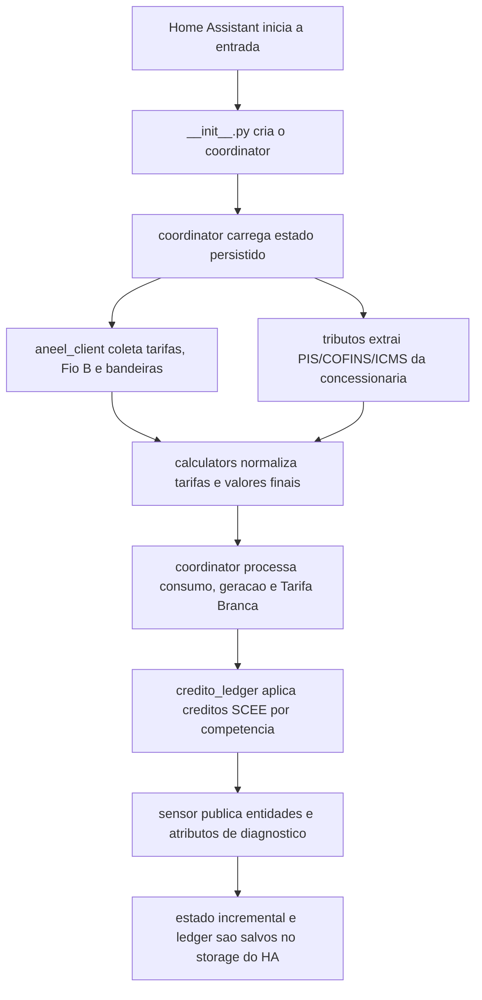

# Documentacao tecnica do codigo - 0.1.0-alpha.5

Gerado em: 2026-04-24 21:23:28 -03:00  
Criado por: Codex  
Projeto/pasta: ha.ext.tarifas / tarifas_energia_brasil

Esta documentacao foi derivada da leitura dos modulos em `custom_components/tarifas_energia_brasil`, dos testes em `tests` e das alteracoes preparadas para o pre-release `0.1.0-alpha.5`.

## Objetivo do pre-release

O `0.1.0-alpha.5` corrige dois pontos de apuracao incremental:

- Reset ou rebase de uma entidade acumulada de energia passa a zerar o delta incremental daquele instante, preservando os acumuladores ja apurados no ciclo corrente.
- Auto-consumo com geracao/SCEE passa a ser calculado como `energia gerada - energia injetada`, limitado ao minimo de `0 kWh`.

Essas correcoes evitam que uma leitura acumulada reiniciada seja interpretada como consumo novo e melhoram a semantica dos sensores `auto_consumo_kwh` e `auto_consumo_reais`.

## Fluxo de funcionamento



## Estrutura dos modulos

| Modulo | Responsabilidade |
|---|---|
| `__init__.py` | Registra a integracao, cria o `TarifasEnergiaBrasilCoordinator`, faz primeira atualizacao e gerencia unload/reload. |
| `const.py` | Centraliza dominio, versao, chaves de configuracao, concessionarias suportadas, grupos de sensores, defaults e ordem de fallback ANEEL. |
| `config_flow.py` | Implementa fluxo inicial e options flow com selecao de concessionaria, entidades, frequencia, quebras, grupos e horarios da Tarifa Branca. |
| `coordinator.py` | Orquestra coleta externa, calculos, acumuladores temporais, reset de sensores, ledger SCEE, diagnosticos e persistencia. |
| `aneel_client.py` | Consulta datasets da ANEEL por `datastore_search`, `datastore_search_sql` e fallback CSV/XML. |
| `calculators.py` | Contem funcoes puras para tributos por dentro, tarifas, bandeira, disponibilidade, Fio B, SCEE e auto-consumo. |
| `credito_ledger.py` | Mantem creditos por competencia, ordena do mais antigo para o mais novo, consome saldo e remove vencidos em 60 meses. |
| `sensor.py` | Define descricoes de sensores, cria entidades dinamicas por grupo/quebra e arredonda exibicao numerica. |
| `tarifa_branca_time.py` | Resolve janelas horarias, feriados, posto vigente e rateio temporal de intervalos da Tarifa Branca. |
| `tributos/` | Extrai e normaliza aliquotas de PIS, COFINS e ICMS de fontes das concessionarias. |
| `diagnostics.py` | Expoe diagnosticos estruturados para suporte e depuracao no Home Assistant. |

## Detalhe do coordinator

`TarifasEnergiaBrasilCoordinator` e o centro da integracao. Ele mantem:

- ultima leitura total de consumo e geracao;
- timestamp da ultima leitura;
- acumuladores de `daily`, `weekly` e `monthly`;
- acumuladores por posto da Tarifa Branca;
- ledger de creditos SCEE;
- flags de reset, confianca e diagnostico.

O metodo `_async_update_data()` executa a coleta completa. Ele carrega o estado persistido, consulta ANEEL e tributos em paralelo, le as entidades configuradas, processa acumuladores e monta um `SnapshotCalculo` com valores, metadados e diagnosticos.

O listener `_handle_tracked_state_change()` atualiza valores dinamicos quando entidades de consumo ou geracao mudam, sem repetir chamadas externas.

## Reset de entidades acumuladas

Entidades de energia com `state_class: total_increasing` podem reiniciar por troca de sensor, restauracao do Home Assistant ou rebase do medidor. A logica atual:

1. `_prepare_delta_context()` calcula `delta = leitura_atual - leitura_anterior`.
2. Se `delta < 0`, marca `reset_detected = True`.
3. Para reset, `delta_kwh` vira `0.0`.
4. Os acumuladores existentes sao preservados se ainda estiverem na mesma chave de periodo.
5. Se houver troca de dia, semana ou ciclo mensal, `_ensure_scalar_current_keys()` e `_ensure_posto_current_keys()` fazem rollover normal.

Com isso, uma leitura atual como `291.83 kWh` apos uma leitura anterior de `1280.50 kWh` nao e copiada automaticamente para todos os acumuladores. Ela passa a ser apenas a nova referencia para os proximos deltas.

## Auto-consumo SCEE

O sensor `auto_consumo_kwh` agora usa a funcao:

```python
def calcular_auto_consumo_kwh(gerado_kwh: float, injetado_kwh: float) -> float:
    return max(max(gerado_kwh, 0.0) - max(injetado_kwh, 0.0), 0.0)
```

Na pratica:

- `gerado_kwh` vem do acumulador de geracao do periodo mensal.
- `injetado_kwh` usa `credito_gerado_kwh` calculado pelo SCEE.
- `auto_consumo_reais` multiplica o auto-consumo pela tarifa convencional final.

Esse modelo separa energia consumida localmente da energia excedente que virou credito.

## Objetos e funcoes principais

### `CollectionMetadata`

Objeto de metadados publicado por sensor. Ele carrega fonte, dataset, recurso, metodo de acesso, uso de fallback, quantidade de tentativas, confianca e vigencia.

### `SnapshotCalculo`

Snapshot usado pelo coordinator e pelos sensores. Contem:

- `updated_at`;
- `concessionaria`;
- `values`;
- `collections_by_key`;
- `diagnostics`.

### `CreditoEntry`

Entrada de credito por competencia mensal:

- `competencia`: texto `YYYY-MM`;
- `kwh`: saldo de credito.

Funcoes associadas:

- `purge_expired_credits()`: remove creditos fora da janela de validade.
- `consume_credits_oldest_first()`: consome creditos mais antigos primeiro.
- `add_credit_entry()`: soma ou cria saldo de credito por competencia.
- `total_credits_kwh()`: retorna saldo total.

### Funcoes de calculo

| Funcao | Papel |
|---|---|
| `aplicar_tributos_por_dentro()` | Aplica PIS, COFINS e ICMS por dentro. |
| `calcular_tarifa_convencional()` | Retorna tarifa convencional bruta e final. |
| `calcular_tarifa_branca_por_posto()` | Calcula tarifa branca por `fora_ponta`, `intermediario` e `ponta`. |
| `calcular_valor_conta_regular()` | Calcula custo regular por periodo. |
| `calcular_valor_conta_tarifa_branca()` | Calcula custo por consumo rateado entre postos. |
| `calcular_fio_b_final()` | Aplica transicao regulatoria e tributos ao Fio B. |
| `calcular_scee_creditos_prioritarios()` | Calcula SCEE consumindo creditos antigos antes da geracao nova. |
| `calcular_auto_consumo_kwh()` | Calcula geracao local consumida antes de virar credito. |

## Sensores afetados pelo alpha.5

| Sensor | Impacto |
|---|---|
| `valor_conta_consumo_regular_*_r` | Evita inflar valores quando a entidade acumulada reinicia. |
| `valor_conta_tarifa_branca_*_r` | Evita classificar a leitura de reset inteira no posto atual. |
| `valor_conta_com_geracao_*_r` | Usa acumuladores preservados apos reset. |
| `valor_fio_b_compensada_*_r` | Usa energia compensada calculada sobre acumuladores sem contaminacao de rebase. |
| `auto_consumo_kwh` | Passa a refletir `gerado - injetado`. |
| `auto_consumo_reais` | Passa a refletir o novo auto-consumo multiplicado pela tarifa final. |

## Diagnosticos relevantes

O coordinator publica informacoes de apoio em `diagnostics`, incluindo:

- `consumo_reset_detectado`;
- `geracao_reset_detectado`;
- `consumo_mensal_kwh_apurado`;
- `geracao_mensal_kwh_apurado`;
- `tarifa_branca_low_confidence`;
- `tarifa_branca_posto_atual`;
- `saldo_creditos_disponiveis_kwh`;
- `credito_consumido_estimado_atual_kwh`;
- `credito_gerado_estimado_atual_kwh`;
- `ledger_creditos`;
- `icms_source`;
- `tarifas_selection_debug`;
- `fio_b_selection_debug`.

## Testes associados

Os testes adicionados ou ajustados cobrem:

- `_prepare_delta_context()` retornando `delta_kwh = 0.0` em reset.
- Acumuladores escalares preservando valores ja existentes no ciclo corrente.
- Acumuladores da Tarifa Branca preservando valores por posto e removendo baixa confianca artificial em reset.
- `calcular_auto_consumo_kwh()` retornando `gerado - injetado`.
- `_apply_dynamic_values_to_snapshot()` publicando `auto_consumo_kwh` e `auto_consumo_reais` com a nova regra.

Comando recomendado:

```powershell
pytest
```

## Limitacoes mantidas

- A Tarifa Branca ainda depende da granularidade da entidade acumulada de consumo; leituras muito espacadas reduzem precisao do rateio por posto.
- O modelo SCEE continua uma estimativa operacional e deve ser validado contra faturas reais antes de tratar casos regulatorios finos como definitivos.
- Extratores web de tributos continuam sujeitos a mudancas de layout nos sites das concessionarias.
