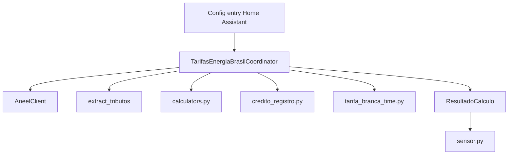

# Manual tecnico do codigo - Tarifas Energia Brasil

Versao documentada: 0.1.0  
Gerado em: 2026-04-27 14:45:00 -03:00  
Criado por: Codex  
Projeto/pasta: ha.ext.tarifas / tarifas_energia_brasil

Este documento registra o estado tecnico da primeira release oficial da integracao. Alteracoes historicas completas ficam no `CHANGELOG.md`.

## Atualizacao 0.1.0

A versao `0.1.0` promove a integracao para release oficial e corrige o tratamento de leituras temporariamente indisponiveis no boot do Home Assistant.

Antes desta versao, leituras `unknown`, `unavailable` ou ausentes podiam ser tratadas como `0.0`, causando falso reset ou delta incorreto quando a entidade acumulada real voltava a carregar. A partir desta versao, a referencia incremental anterior e preservada quando a leitura ainda nao esta disponivel.

## Arquitetura

## Modulos principais

| Modulo | Responsabilidade |
|---|---|
| `__init__.py` | Inicializa a entrada, cria o coordinator, encaminha plataformas e persiste estado no unload. |
| `coordinator.py` | Orquestra coleta externa, acumuladores, calculos, persistencia e diagnosticos. |
| `aneel_client.py` | Consulta datasets ANEEL por CKAN e alternativo configurado. |
| `calculators.py` | Calcula tarifas, tributos, disponibilidade, Fio B, bandeira e SCEE. |
| `sensor.py` | Publica entidades de sensor a partir de `ResultadoCalculo.valores`. |

## Comportamento de acumuladores

As entidades de consumo, geracao e injecao sao tratadas como acumuladores. O coordinator calcula deltas entre leituras validas e distribui esses deltas nas quebras configuradas:

- `diario`;
- `semanal`;
- `mensal`.

Leituras temporariamente indisponiveis nao alteram a referencia nem os acumuladores.

## Persistencia

O estado incremental e salvo no `Store` local do Home Assistant. A persistencia guarda referencias de leitura, acumulados por periodo, flags de reset e registro de creditos.

## Testes

A release adicionou cobertura para garantir que leitura indisponivel no startup nao altera referencia incremental nem acumuladores atuais.
