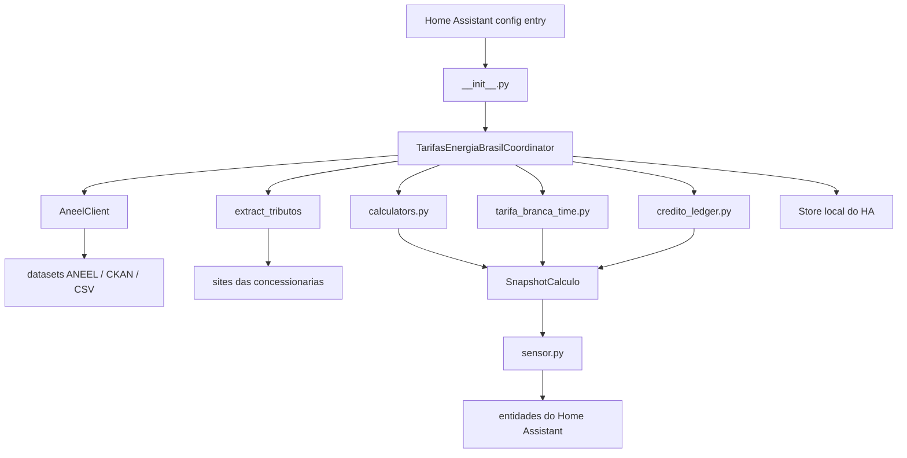

# Manual tecnico do codigo - Tarifas Energia Brasil

Versao documentada: 0.1.4  
Gerado em: 2026-04-27 14:35:00 -03:00  
Criado por: Codex  
Projeto/pasta: ha.ext.tarifas / tarifas_energia_brasil

Este documento e um mapa tecnico para desenvolvedores entenderem como a extensao funciona na versao atual. Ele descreve arquitetura, fluxo de execucao, objetos, funcoes, sensores, persistencia, diagnosticos e pontos de manutencao. Alteracoes historicas completas ficam no `CHANGELOG.md`.

## Atualizacao 0.1.4

A versao `0.1.4` nao altera formulas de tarifa. Ela melhora a observabilidade da coleta externa, principalmente para investigar falhas intermitentes da ANEEL/CKAN e do fallback CSV.

Quando um metodo ANEEL falha, o cliente passa a registrar no log:

- dataset afetado;
- metodo que falhou (`datastore_search`, `datastore_search_sql` ou `csv_xml`);
- proximo metodo de fallback, quando existir;
- filtros usados na consulta;
- tipo e mensagem da excecao.

Quando a coleta completa falha no coordinator, o log passa a informar se existe ultimo snapshot valido sendo mantido nos sensores, ou se nao ha cache valido para restauracao, alem do horario previsto para a proxima tentativa automatica.

## Evolucao desde 0.1.0-alpha.10

As releases oficiais apos `0.1.0-alpha.10` adicionaram quatro mudancas importantes ao comportamento operacional:

| Versao | Mudanca principal |
|---|---|
| `0.1.0` | Leituras temporariamente indisponiveis deixam de ser tratadas como `0.0`, evitando falso reset no boot do Home Assistant. |
| `0.1.1` | ICMS passa a considerar a disponibilidade minima faturavel (`30/50/100 kWh`) quando ela for maior que o consumo mensal apurado; creditos SCEE foram separados entre disponibilidade e energia. |
| `0.1.2` | Setup da integracao deixa de bloquear aguardando primeira coleta externa completa; a primeira atualizacao passa a rodar em background. |
| `0.1.3` | Ultimo snapshot valido passa a ser persistido/restaurado; fallback CSV da ANEEL passa a ler arquivos grandes em streaming com delimitador detectado e encoding compativel. |
| `0.1.4` | Logs de fallback e falha de coleta passam a trazer filtros, metodo, tipo de erro e previsao de nova tentativa. |

## Visao geral

`Tarifas Energia Brasil` e uma integracao customizada para Home Assistant publicada como repositorio HACS. A integracao consulta fontes abertas da ANEEL e paginas de concessionarias para estimar tarifas, tributos e valores de conta de energia no Brasil.

Ela trabalha com tres eixos principais:

- coleta de dados externos: tarifas ANEEL, componentes tarifarios, bandeiras e tributos;
- apuracao local: leitura de entidades acumuladas de consumo, geracao e injecao no Home Assistant;
- publicacao: sensores de tarifas, tributos, bandeira, valores estimados de conta, Tarifa Branca e geracao/SCEE.

O dominio da integracao e `tarifas_energia_brasil`.

## Arquitetura



## Estrutura de pastas

| Caminho | Finalidade |
|---|---|
| `custom_components/tarifas_energia_brasil/` | Codigo da integracao Home Assistant. |
| `custom_components/tarifas_energia_brasil/tributos/` | Parsers e extratores de tributos de concessionarias. |
| `custom_components/tarifas_energia_brasil/translations/` | Textos de UI para o Home Assistant. |
| `custom_components/tarifas_energia_brasil/brand/` | Icone da integracao. |
| `tests/` | Testes unitarios e stubs de Home Assistant. |
| `tests/fixtures/` | Amostras HTML usadas pelos parsers de tributos. |
| `docs/` | Documentacao auxiliar por tema. |
| `bin/`, `log/`, `data/` | Pastas reservadas para scripts, logs e dados auxiliares quando necessario. |

## Modulos principais

| Modulo | Responsabilidade |
|---|---|
| `__init__.py` | Registra a integracao, cria o coordinator, restaura estado salvo, encaminha plataformas e agenda a primeira atualizacao em background. |
| `const.py` | Centraliza dominio, versao, constantes, chaves de configuracao, defaults, concessionarias, grupos de entidade e fallback ANEEL. |
| `config_flow.py` | Implementa fluxo inicial e options flow no Home Assistant. |
| `coordinator.py` | Orquestra coleta, calculos, acumuladores, persistencia, ledger SCEE, diagnosticos e cache do ultimo snapshot valido. |
| `aneel_client.py` | Cliente CKAN da ANEEL com fallback entre metodos de acesso e parser CSV em streaming. |
| `calculators.py` | Funcoes puras de conversao, tarifa, tributos, disponibilidade, Fio B, bandeira e SCEE. |
| `credito_ledger.py` | Controle dos creditos de energia por competencia mensal. |
| `tarifa_branca_time.py` | Horarios, feriados, posto tarifario vigente e rateio temporal da Tarifa Branca. |
| `sensor.py` | Definicao e criacao das entidades `sensor`. |
| `models.py` | Dataclasses compartilhadas entre coleta, calculo e publicacao. |
| `diagnostics.py` | Payload de diagnostico redigindo entidades configuradas. |

## Ciclo de vida no Home Assistant

1. `async_setup()` cria `hass.data[DOMAIN]`.
2. `async_setup_entry()` instancia `TarifasEnergiaBrasilCoordinator`.
3. O coordinator executa `async_ensure_state_loaded()` antes de criar entidades, permitindo restaurar `last_snapshot` persistido.
4. As plataformas de sensor sao carregadas via `async_forward_entry_setups()`.
5. A integracao registra listeners de mudanca das entidades de consumo, geracao e injecao.
6. A primeira coleta externa e agendada por `hass.async_create_task()` em `_async_refresh_after_setup()`.
7. Se a primeira coleta falhar, a entrada permanece carregada; novas tentativas seguem o ciclo normal do `DataUpdateCoordinator`.
8. Quando options mudam, `async_reload_entry()` recarrega a entrada.
9. No unload, listeners sao removidos e o estado incremental e persistido.

## Configuracao

O fluxo inicial (`TarifasEnergiaBrasilConfigFlow`) pede:

- `concessionaria`: concessionaria suportada no fluxo;
- `dia_leitura_reset_mensal`: dia de fechamento do ciclo mensal;
- `frequencia_atualizacao_horas`: intervalo de coleta externa;
- `meio_prioritario_aneel`: metodo preferencial para consulta ANEEL;
- `entidade_consumo_kwh`: sensor acumulado de consumo;
- `entidade_geracao_kwh`: sensor acumulado de geracao, opcional;
- `entidade_injecao_kwh`: sensor acumulado de energia injetada, opcional e recomendado para SCEE/auto-consumo preciso;
- `tipo_fornecimento`: `monofasico`, `bifasico` ou `trifasico`;
- `quebras_calculo`: `daily`, `weekly` e/ou `monthly`.

O options flow tambem permite:

- habilitar ou ocultar o grupo `Geracao/SCEE`;
- habilitar ou ocultar o grupo `Tarifa Branca`;
- sobrescrever horarios da Tarifa Branca;
- informar feriados extras em `YYYY-MM-DD`.

## Coleta ANEEL

`AneelClient` usa a ordem retornada por `get_aneel_method_fallback_order()`:

1. metodo prioritario configurado;
2. demais metodos suportados na ordem padrao.

Metodos suportados:

- `datastore_search`;
- `datastore_search_sql`;
- `csv_xml`.

Timeouts atuais:

| Origem | Timeout |
|---|---:|
| ANEEL JSON/CKAN | `120s` |
| ANEEL CSV/XML | `600s` |
| Sites de concessionarias | `60s` |

### Fallback CSV em streaming

O fallback `csv_xml` primeiro consulta `resource_show` para obter a URL do recurso. Em seguida, baixa a resposta em chunks (`CSV_STREAM_CHUNK_SIZE`) e processa linha a linha.

O parser:

- decodifica com `CSV_STREAM_ENCODING = "latin-1"`;
- detecta delimitador `,` ou `;` pela primeira linha util;
- remonta linhas quebradas entre chunks;
- usa `csv.reader` para respeitar campos com aspas;
- aplica filtros imediatamente e guarda em memoria apenas os registros filtrados.

Isso evita carregar arquivos CSV grandes completos em memoria.

### Fio B

`fetch_fio_b()` consulta os recursos de componentes tarifarios de anos recentes em `RESOURCE_FIO_B_ANOS`. O filtro usado e:

```json
{
  "SigNomeAgente": "<concessionaria>",
  "DscComponenteTarifario": "TUSD_FioB"
}
```

A selecao final considera vigencia, modalidade, posto tarifario, subgrupo, classe, subclasse, detalhe e base tarifaria. A prioridade favorece linha residencial B1, nao social, `Tarifa de Aplicacao`, sem detalhe especial.

Para `CPFL-PIRATINING`, o fallback CSV corrige casos em que o datastore CKAN nao retorna registros mesmo havendo linhas vigentes no CSV publicado.

## Coleta de tributos

`extract_tributos()` usa parsers por concessionaria em `custom_components/tarifas_energia_brasil/tributos/`. Quando uma pagina nao fornece os campos esperados, a integracao usa fallback configurado por concessionaria e registra nivel de confianca.

Os tributos alimentam:

- PIS;
- COFINS;
- ICMS fallback;
- expressoes diagnosticas dos sensores.

## Persistencia

O coordinator usa `Store` do Home Assistant para persistir estado incremental. O payload inclui:

- estados por periodo de consumo, geracao, injecao e Tarifa Branca;
- flags de reset detectado;
- saldos e ledger de creditos SCEE;
- ultimo snapshot valido em `last_snapshot`.

`last_snapshot` contem:

- `updated_at`;
- `concessionaria`;
- `values`;
- `collections_by_key`;
- `diagnostics`.

Na carga, `_restore_cached_snapshot()` reconstrói `SnapshotCalculo` e adiciona `snapshot_restaurado_de_cache = True` nos diagnosticos. Se nao existir snapshot valido, os sensores dependem da primeira coleta bem-sucedida para sair de `unavailable`.

## Processamento de acumuladores

O coordinator le entidades acumuladas de energia e calcula deltas por periodo. Leituras `unknown`, `unavailable` ou ausentes nao sao convertidas para zero, evitando que o boot do Home Assistant gere um delta incorreto na proxima leitura real.

Periodos suportados:

- diario (`daily`): reset na virada do dia;
- semanal (`weekly`): reset na semana;
- mensal (`monthly`): reset conforme `dia_leitura_reset_mensal`.

O fechamento mensal considera a data de leitura configurada. Para leitura no dia 24, o ciclo mensal reinicia na virada do dia 23 para 24.

## Calculos principais

`calculators.py` concentra funcoes puras para:

- converter R$/MWh para R$/kWh;
- aplicar PIS/COFINS/ICMS;
- calcular tarifa convencional e Tarifa Branca;
- calcular bandeira tarifaria;
- calcular disponibilidade minima;
- calcular Fio B efetivo;
- calcular SCEE com creditos prioritarios.

O ICMS aplicado usa consumo mensal faturavel. Quando a disponibilidade minima (`30/50/100 kWh`) for maior que o consumo mensal apurado, ela passa a ser a base para selecao da faixa de ICMS.

## Sensores

`sensor.py` cria entidades a partir de `TarifaSensorDescription`. O valor vem de `SnapshotCalculo.values`.

Grupos:

- `regular`: tarifas, tributos, bandeira e conta regular;
- `geracao`: SCEE, creditos, auto-consumo e conta com geracao;
- `tarifa_branca`: postos e valores da Tarifa Branca.

Sensores podem expor atributos de diagnostico com:

- formula usada;
- fonte e confianca;
- vigencia de dados ANEEL;
- ICMS aplicado;
- faixa utilizada;
- metadados de coleta;
- mensagem de erro da ultima falha, quando houver.

## Diagnosticos e logs

Os diagnosticos removem ou redigem entidades configuradas para evitar expor nomes internos desnecessarios.

Logs adicionados em `0.1.4`:

- `ANEEL fallback acionado...`: metodo falhou e existe proximo fallback;
- `ANEEL fallback concluido...`: coleta teve sucesso depois de fallback;
- `ANEEL metodo final falhou...`: ultimo metodo tambem falhou;
- `Coleta de tarifas falhou... mantendo ultimo snapshot valido...`: sensores continuam com ultimo valor valido;
- `Coleta inicial de tarifas falhou... nao ha snapshot valido...`: sensores podem permanecer indisponiveis ate uma coleta bem-sucedida.

## Testes

A suite cobre:

- calculos puros de tarifa, ICMS, disponibilidade, Fio B e SCEE;
- Tarifa Branca e feriados;
- parsers de tributos;
- fallback ANEEL e timeouts;
- CSV em streaming com chunks quebrados, delimitador `;`, encoding latin-1 e campos entre aspas;
- restauracao de snapshot apos restart;
- setup sem bloquear o bootstrap do Home Assistant;
- logs de falha ANEEL com filtros e tipo de excecao.

Comandos de validacao usados nesta versao:

```powershell
python -m pytest
python -m ruff check custom_components tests
```

## Pontos de manutencao

- Ao alterar formulas, adicionar ou atualizar testes em `tests/` antes de publicar release.
- Ao adicionar entidade nova, revisar `sensor.py`, README, diagnosticos e este manual tecnico.
- Ao alterar coleta externa, manter logs com filtros, origem, metodo e motivo de fallback.
- Ao alterar persistencia, manter compatibilidade com payloads antigos do `Store`.
- Ao publicar release, atualizar `VERSION`, `manifest.json`, `README.md`, `CHANGELOG.md` e gerar novo `DOCUMENTACAO_CODIGO_<versao>.md`.
